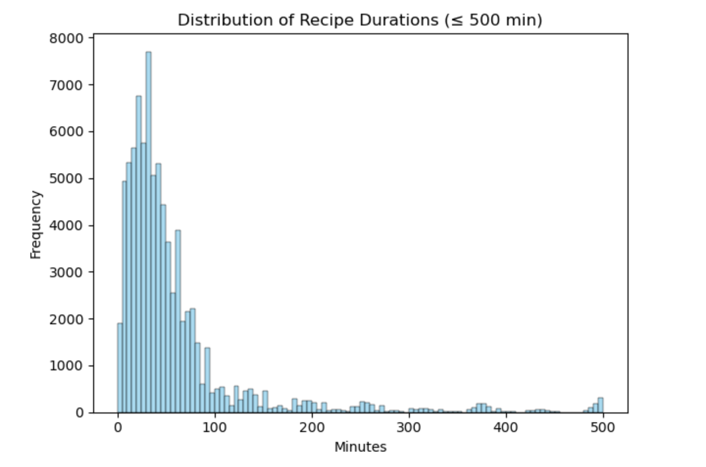
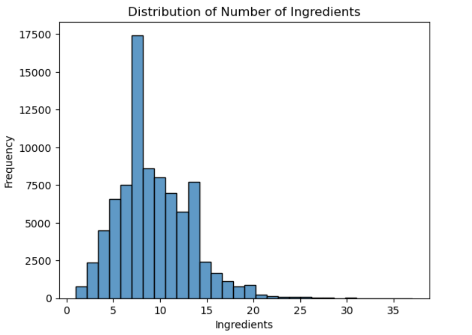
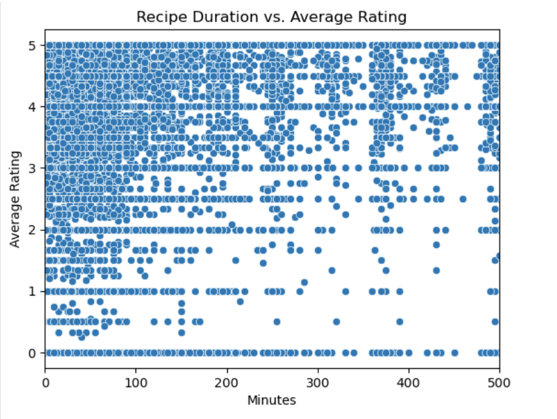
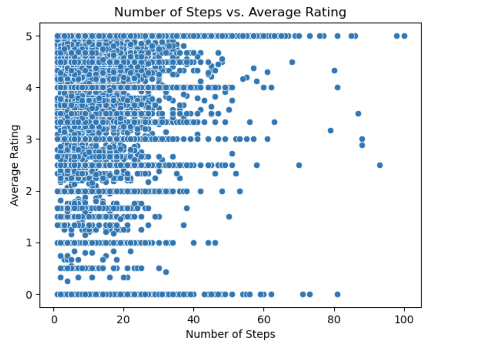
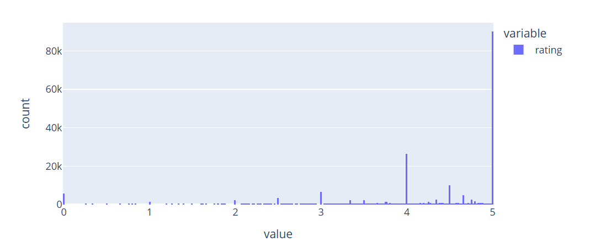
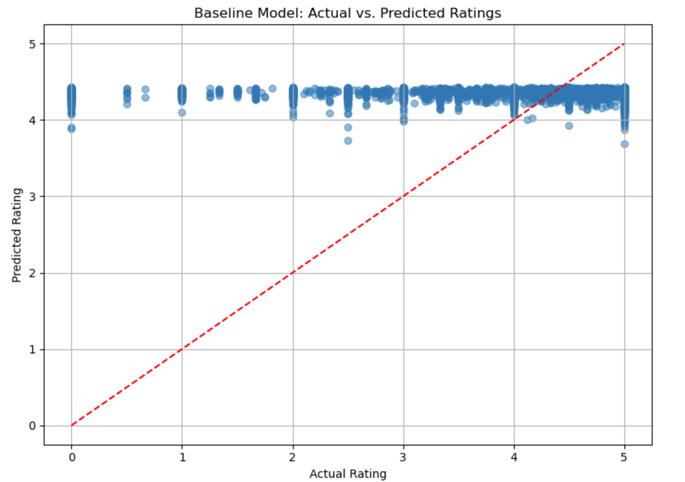
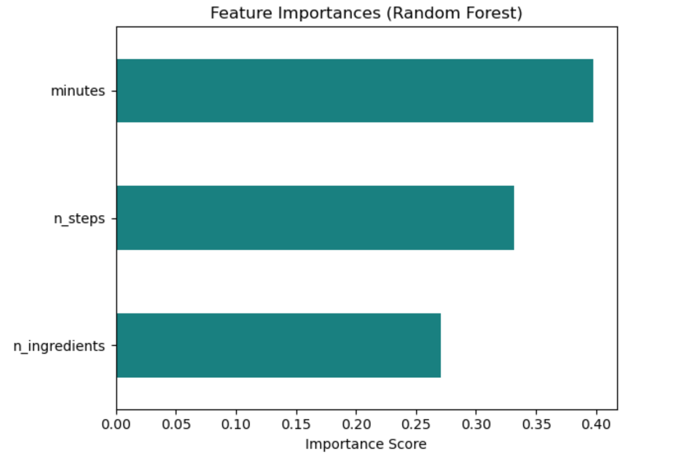

## Introduction

This project explores whether we can predict the rating of a recipe based on certain attributes such as cooking time, number of steps, and ingredients.

We use the [Recipe Interactions Dataset](https://www.kaggle.com/datasets/kaggle/recipe-ingredients-dataset) with the following columns:
- `id`: Unique recipe identifier
- `minutes`: Time required to make the recipe
- `n_steps`: Number of preparation steps
- `n_ingredients`: Number of ingredients used
- `rating`: User rating for each recipe (0–5)

We focus on predicting the **average rating** of each recipe based on structural attributes. The dataset contains approximately **N rows** after cleaning.

## Data Cleaning

We removed rows with missing values in the key features (`minutes`, `n_steps`, `n_ingredients`). Ratings were aggregated by computing the mean rating per recipe ID.

## Univariate Analysis

We visualized distributions of:
- Recipe durations (minutes)
- Number of steps
- Number of ingredients

Each showed right-skewed distributions. Most recipes are short and require a small number of steps and ingredients.

**Distribution of recipe durations:**

**Distribution of number of ingredients:**

## Bivariate Analysis

We plotted scatterplots to observe correlation between numeric variables. Correlation with average rating was weak, but some linearity was observed with steps and ingredients.

**Rating vs. number of ingredients:**

**Rating vs. number of steps:**

## Interesting Aggregates

We grouped recipes by number of ingredients and visualized the average rating. This showed that recipes with very few or very many ingredients tended to receive lower ratings.

## Prediction Problem

We pose a **regression** problem: Can we predict the average rating of a recipe based on its structure?

- **Response variable**: `rating` (continuous)
- **Features**: `minutes`, `n_steps`, `n_ingredients`
- **Why this matters**: Understanding what makes recipes successful could inform app recommendations or recipe design.

We evaluate models using **Root Mean Squared Error (RMSE)**, which reflects the average prediction error.

## Baseline Model

We trained a simple Linear Regression model using:
- `minutes`
- `n_steps`
- `n_ingredients`

These features were used directly without transformation or encoding.

**Baseline RMSE**: *1.0906*

This gives us a reference to compare more complex models against.

## Final Model

We used a Random Forest Regressor with the following improvements:
- Engineered feature: `steps_per_ingredient`
- Used `StandardScaler` and `QuantileTransformer` in a `ColumnTransformer`
- Performed GridSearchCV on `n_estimators` and `max_depth`

**Best Parameters**:
- `n_estimators`: 100
- `max_depth`: 10

**Final Model RMSE**: *1.0966* (similar to baseline)

**Feature importances (Final Model):**

Despite feature engineering and tuning, the gain was marginal—possibly due to weak signal in the features.

### Feature Importances:

